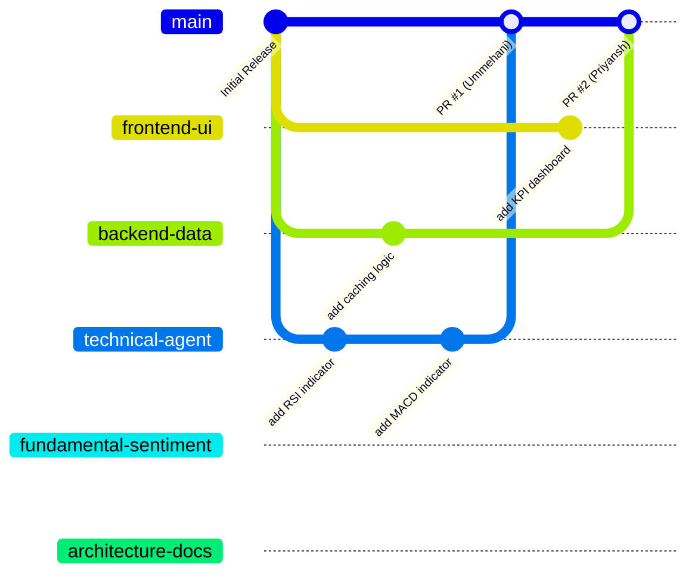

# Team Development Workflow Protocol

This document outlines the standard operational procedures for the Capgemini Buildathon multi-agent stock research project. Following these guidelines ensures code quality, prevents branch drifts, and minimises merge conflict friction.

---

## 1. Branching Strategy

Our project uses a **Feature-Branch Workflow** to isolate individual areas of responsibility:



### Core Branching Rules:
- **`main` Branch (Stable)**: Represents the production-ready state. No team member is allowed to push commits directly to `main`. All changes to `main` must arrive via Pull Requests.
- **Dedicated Team Branches**:
  - `frontend-ui` (Abhinav)
  - `backend-data` (Priyansh)
  - `technical-agent` (Ummehani)
  - `fundamental-sentiment` (Suhani)
  - `architecture-docs` (Vedant)
- **Sub-feature Branches (Optional)**: If working on a sub-feature (e.g., a new database integration), branch off from your dedicated branch using names like `feat/backend-data/db-setup`.

---

## 2. Daily Development Process

Follow this routine every day to avoid code isolation:

### Step 2.1: Morning Sync & Pull
Start your day by syncing with the remote repository:
```bash
# Move to your branch
git checkout <your-branch-name>

# Pull latest commits from your remote branch
git pull origin <your-branch-name>
```

### Step 2.2: Merging Main Updates
If another team member has merged their features into `main`, pull those changes immediately to stay aligned and address compatibility issues early:
```bash
# Fetch changes from remote
git fetch origin

# Merge remote main into your current feature branch
git merge origin/main
```

### Step 2.3: Local Development & Verification
- Edit code inside the recommended multi-agent folder structure.
- **Run local tests**:
  - Run the FastAPI backend: `python main.py` in `backend/` and check `http://localhost:8000/docs`.
  - Run the React frontend: `npm run dev` in `frontend/` and check `http://localhost:5173`.
- Before staging, verify the application launches and there are no runtime or compilation errors.

---

## 3. Merge Process

When a feature is complete, it must go through a formal code review before merging into `main`.

### Step 3.1: Commit and Push
```bash
git add .
git commit -m "feat(<scope>): explain what was added"
git push origin <your-branch-name>
```

### Step 3.2: Create the Pull Request (PR)
- Target: `main` ⟵ Source: `<your-branch-name>`
- Provide a clear description of:
  1. What features were introduced or bugs fixed.
  2. How they were tested locally.
  3. Any changes made to configuration files or dependencies (`requirements.txt` / `package.json`).

### Step 3.3: Peer Review & Approval
- Tag at least **one reviewer** on the team based on scope.
- Reviewer checks:
  - Code readability and compliance with the proposed folder architecture.
  - Proper error handling and lack of hardcoded secrets.
  - Successful execution.
- Once approved, the branch owner or reviewer can perform a **Squash and Merge** to keep the `main` git history clean.

---

## 4. Conflict Resolution Process

Merge conflicts occur when two developers edit the same line of a file, or one deletes a file another is modifying. Follow these steps to resolve them safely:

### Step 4.1: Triggering the Conflict
Conflicts usually show up when you run:
```bash
git checkout <your-branch-name>
git fetch origin
git merge origin/main
```
If Git flags conflicts, it will output:
`CONFLICT (content): Merge conflict in backend/services/stock_service.py. Automatic merge failed; fix conflicts and then commit the result.`

### Step 4.2: Locating Conflict Markers
Open the conflicted files in your editor (e.g., VS Code). Look for conflict markers:
```python
<<<<<<< HEAD
# Your local changes
def calculate_rsi(data):
    return rsi_indicator(data, period=14)
=======
# Changes coming from the main branch
def calculate_rsi(data, period=14):
    return compute_rsi(data, window=period)
>>>>>>> origin/main
```

### Step 4.3: Resolving the Conflict
1. Consult with the other branch owner to decide which version of the code is correct, or merge both behaviors logically.
2. Edit the file to remove the conflict markers (`<<<<<<<`, `=======`, `>>>>>>>`) and keep the correct code.
3. Save the file.

### Step 4.4: Staging and Completing the Merge
Once all conflicts are resolved:
```bash
# Check status to confirm which files are fixed
git status

# Stage the resolved files
git add backend/services/stock_service.py

# Commit to finish the merge
git commit -m "merge: resolve conflict with main in stock_service"

# Push the merged state back to your feature branch
git push origin <your-branch-name>
```
Your PR on GitHub will automatically update and show that conflicts are resolved!
